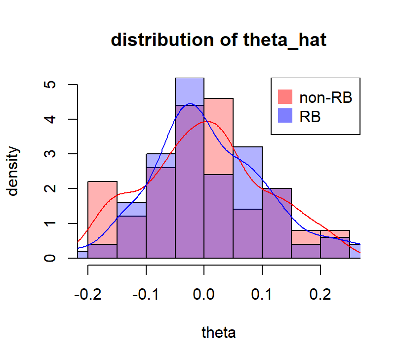
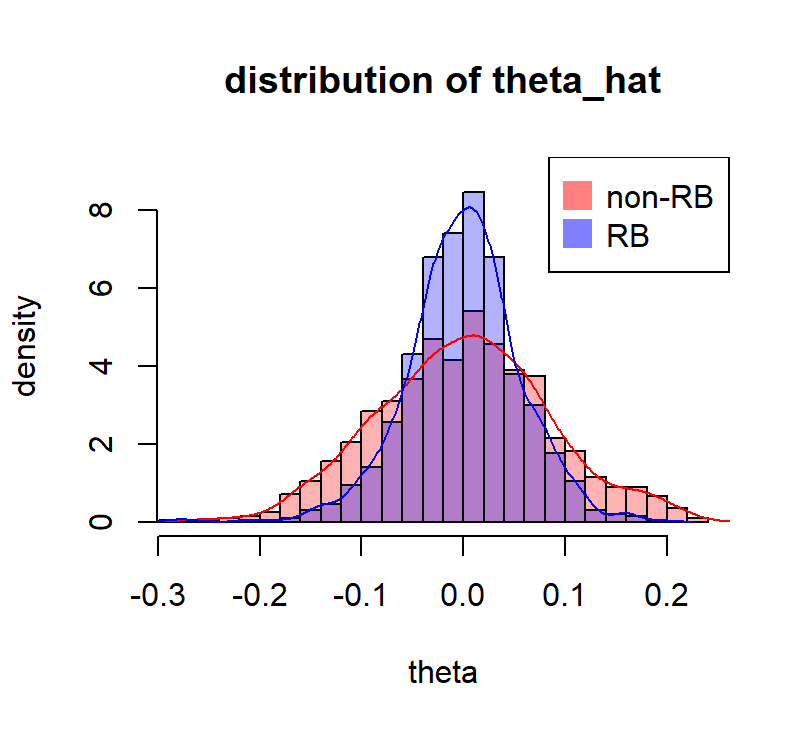
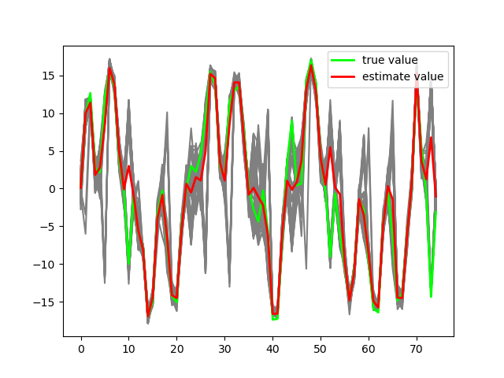
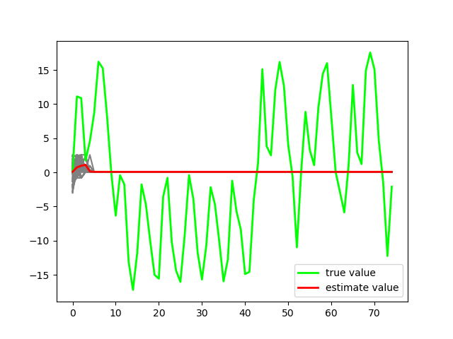

# RB-samplers
This is the final project for Bayesian Statistics 2023 in SJTU.

## AR sampler v.s. RBAR sampler

The results look good but it takes long to compute.

## MH sampler v.s. RBMH sampler

This part of simulation shows great improvement with RB and computation is fast. We can explore the RB-MCMC in the future.

## PF v.s. RBPF

I'm still stuck with this part, more precisely, the RBPF. Time-wising I just set it aside and maybe I can explore it later after my finals are done.

